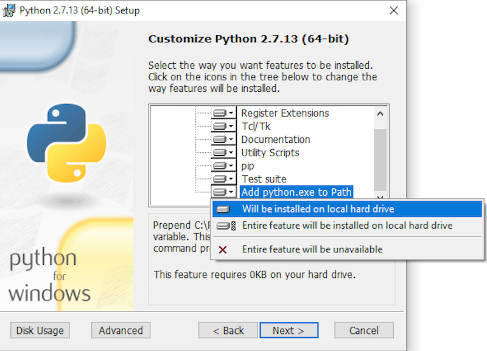

# Gro API Client

## Prequisites for Windows

Install Python version >= 2.7.13 from https://www.python.org/downloads/release/python-2713/.

Make sure to install both Python and pip to PATH either in installer (enable component during the installation) or manually. The easiest way to do this is to make sure the below is checked during installation:



Next, install Git from https://git-scm.com/download/win. Proceed with the default options.

Now, proceed below using Powershell.


## Set up the environment

```sh
mkdir ~/gro
cd ~/gro
git clone https://github.com/gro-intelligence/api-client.git
```

__Linux/OSX__
```sh
export PYTHONPATH=~/gro/api-client:$PYTHONPATH
```
__Powershell on Windows__
```sh
$env:PYTHONPATH = "~/gro/api-client:$env:PYTHONPATH"
```

Install dependencies (note we're using Python 2.7). Note these requirements are for the sample code. You may need more or fewer for your specific application.

```sh
cd ~/gro/api-client/api/client
pip install -r requirements.txt
```

To avoid typing your password on the command line, you can get an API access token as follows:

```sh
cd ~/gro/api-client/api/client
python gro_client.py --user_email='email@example.com' --user_password='securePassword' --print_token
```

To save it in a bash environment variable

```sh
cd ~/gro/api-client/api/client
```

__Linux/OSX__
```sh
export GROAPI_TOKEN=`python gro_client.py --user_email=... --user_password=... --print_token`
```
__Powershell on Windows__
```sh
python gro_client.py --user_email=... --user_password=... --print_token
```
Copy and paste this token into this command
```sh
$env:GROAPI_TOKEN = "TOKEN_FROM_PREVIOUS_COMMAND"
```

For repeated use, you may want to save PYTHONPATH and GROAPI_TOKEN as permanent environment variables in your bash_profile (or equivalent).

## Examples

Try [quick_start.py](api/client/samples/quick_start.py)

```sh
cd ~/gro/api-client/api/client/samples/
python quick_start.py
```

Now should be able to find a sample output csv file at:

```sh
~/gro/api-client/api/client/samples/gro_client_output.csv
```

A more advanced example is [sugar.py](api/client/samples/crop_models/sugar.py)

```sh
cd ~/gro/api-client/api/client/samples/crop_models/
python sugar.py
```

Further documentation can be found in the [api/client/](api/client) directory.
